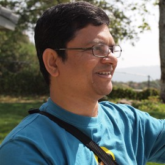
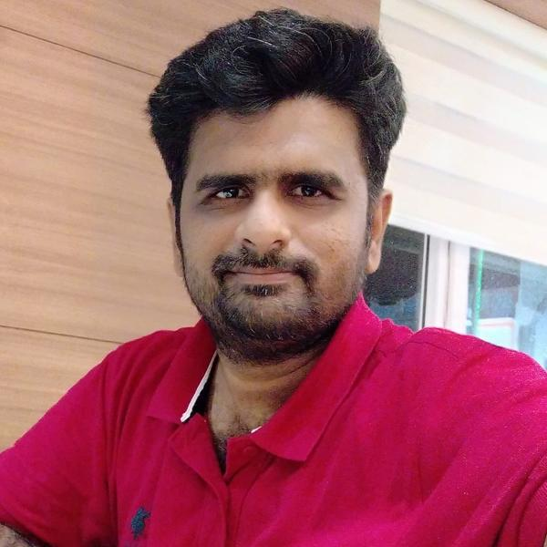
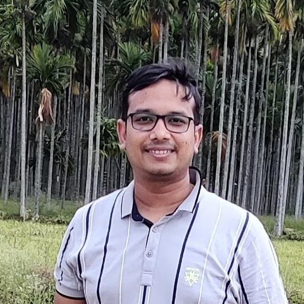
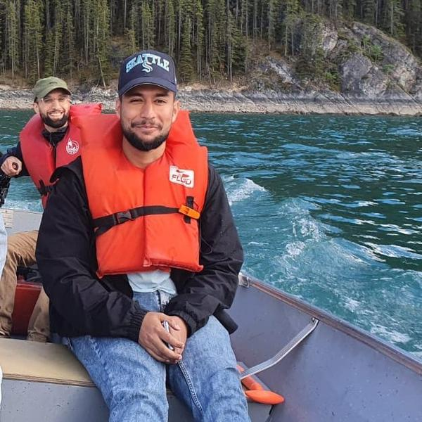
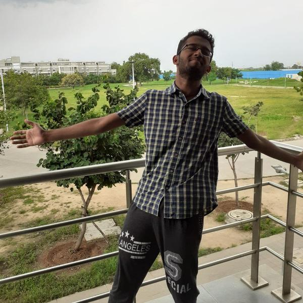
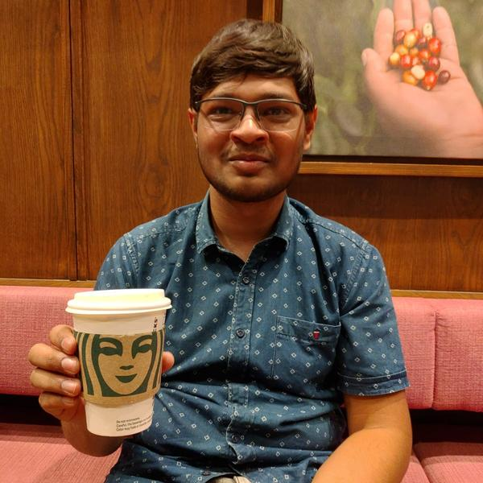
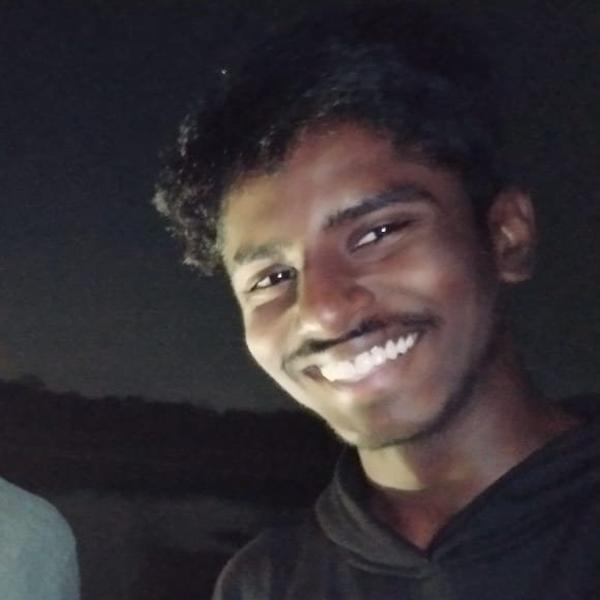

     
    
 I am fortunate to have been advised by some amazing people. Here is a list of whom I have worked with: 

    

        

            
            <a href="https://sites.astro.caltech.edu/~aam/"> Dr. Ashish Mahabal </a>
            
 Astronomer & Lead Computational and Data Scientist, Caltech, USA

        

        

            
            <a href="https://profiles.ucalgary.ca/roberto-souza"> Dr. Roberto Souza </a>
            
  Assistant Professor, University of Calgary, Canada 

        

        

            
            <a href="https://people.iitgn.ac.in/~shanmuga/"> Dr. Shanmuganathan Raman </a>
            
  Associate Professor, IIT Gandhinagar 

        

        

            
            <a href="https://iitgn.ac.in/faculty/cse/mayank"> Dr. Mayank Singh </a>
            
  Assistant Professor, IIT Gandhinagar 

        

        

            
            <a href="http://people.iitgn.ac.in/~abhishek/"> Dr. Abhishek Bichchawat </a>
            
  Assistant Professor, IIT Gandhinagar

        

    

   
      
    
 I am also grateful to have had the support of some amazing friends (in no particular order):

    

        

            
            <a href="https://www.linkedin.com/in/matharg7/"> Muhammad Athar Ganaie </a>
            
  MS in CS, University of Calgary, Canada 

        

        

            
            <a href="https://www.linkedin.com/in/manoj-taraka-ramarao-gunuru/"> Gunuru Manoj Taraka Ramarao </a>
            
  Graduate Analyst, Barclays Corporate & Investment Bank 

        

        

            
            <a href="https://www.linkedin.com/in/harshit-ramolia/"> Harshit Ramolia </a>
            
  Dual Majors EE + CSE, IIT Gandinagar 

        

        

            
            <a href="https://shiva-sankaran.github.io/"> Shivasankaran VP </a>
            
  MS in CS, Stony Brook University, USA 

        

    

